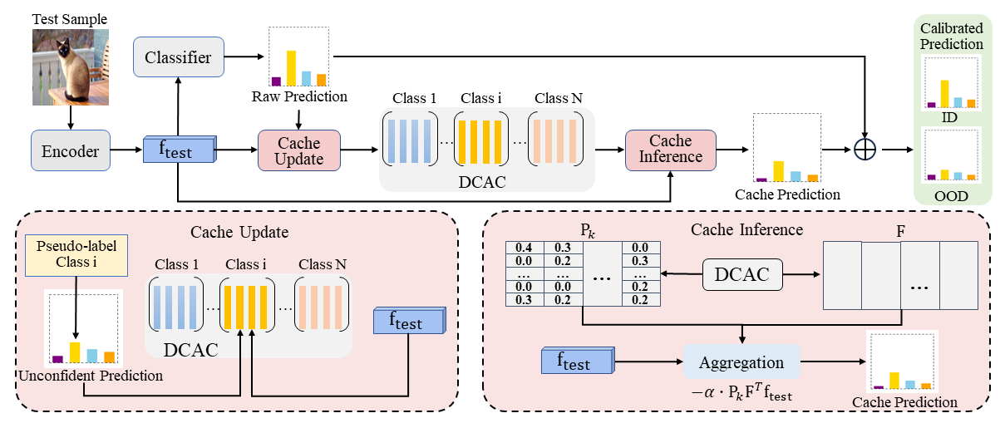

# DCAC: Dynamic Class-Aware Cache Creates Stronger Out-of-Distribution Detectors



The paper has been accepted by AAAI2026.

Arxiv: https://arxiv.org/abs/2601.12468


## Requirements

#### Installation

Create a conda environment and install dependencies:

```bash
pip install -r requirements.txt
```

## Get Started

### Unimodal Models

```shell
cd unimodal
python ood_eval.py --root_dir [your_data_path] --in_dataset [your_id_dataset] --method [ood_method_name] --model [model_architecture]
```

### VLMS

```shell
cd VLM
python ood_eval.py --root_dir [your_data_path] --in_dataset [your_id_dataset] --method [ood_method_name] --model [model_architecture]
```


## Citaiton

If you find our work interesting or use our code/models, please consider citing:

```
@misc{wu2026dcacdynamicclassawarecache,
      title={DCAC: Dynamic Class-Aware Cache Creates Stronger Out-of-Distribution Detectors}, 
      author={Yanqi Wu and Qichao Chen and Runhe Lai and Xinhua Lu and Jia-Xin Zhuang and Zhilin Zhao and Wei-Shi Zheng and Ruixuan Wang},
      year={2026},
      eprint={2601.12468},
      archivePrefix={arXiv},
      primaryClass={cs.CV},
      url={https://arxiv.org/abs/2601.12468}, 
}
```


